

## Описание

Разработка локального поискового движка, который представляет собой Spring-приложение (JAR-файл). Приложение работает с локально установленной базой данных MySQL, имеет простой веб-интерфейс и API для управления и получения результатов поисковых запросов.

### Принципы работы

1. **Конфигурация:** В конфигурационном файле задаются адреса сайтов для индексации.
2. **Индексация:** Поисковый движок обходит и индексирует все страницы заданных сайтов.
3. **Запросы:** Пользователь отправляет запрос через API, который трансформируется в список слов в базовой форме.
4. **Поиск:** Поисковый движок ищет страницы, содержащие все слова из запроса.
5. **Ранжирование:** Результаты поиска сортируются и возвращаются пользователю.
6. **Вывод результатов:** Результаты поиска можно просматривать постранично.

## Демо

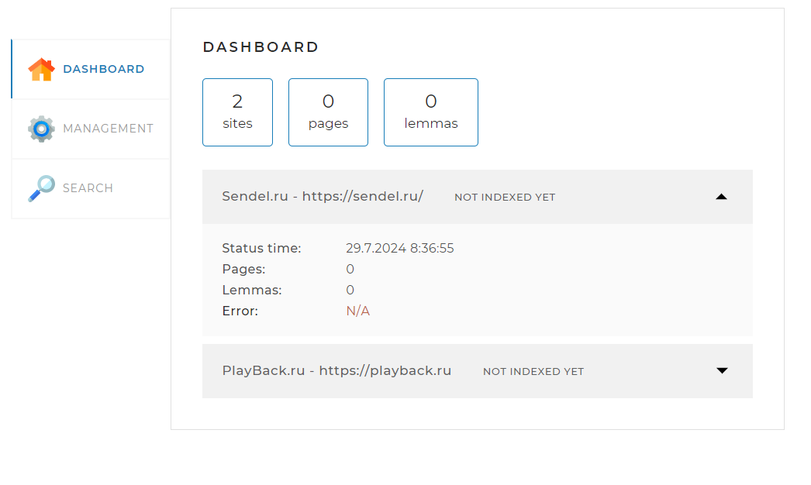
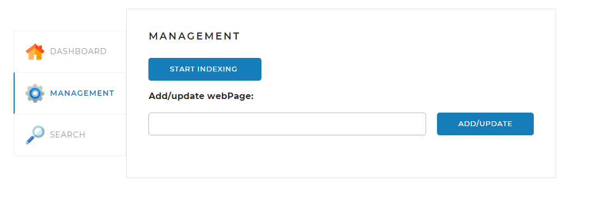

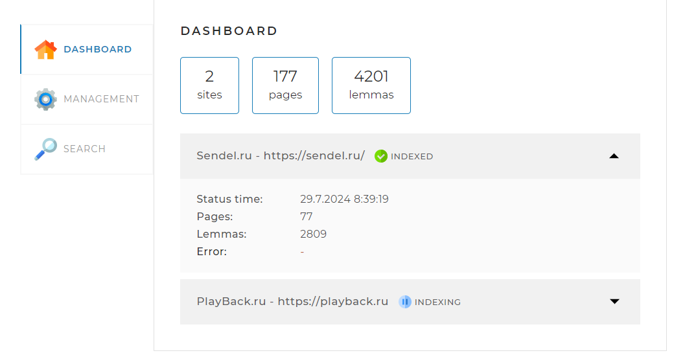
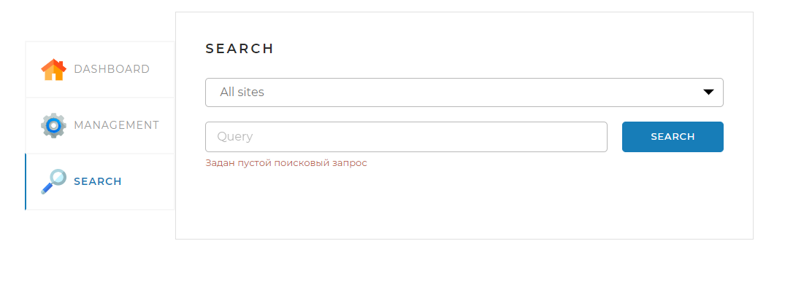
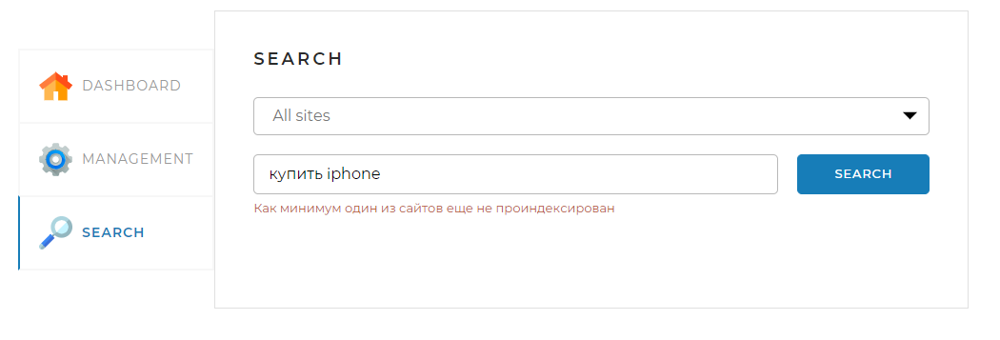
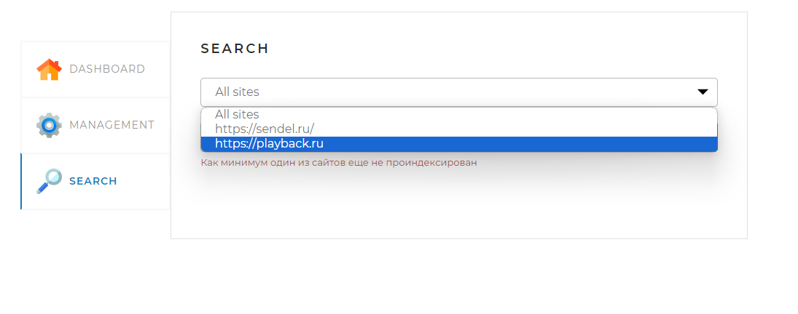
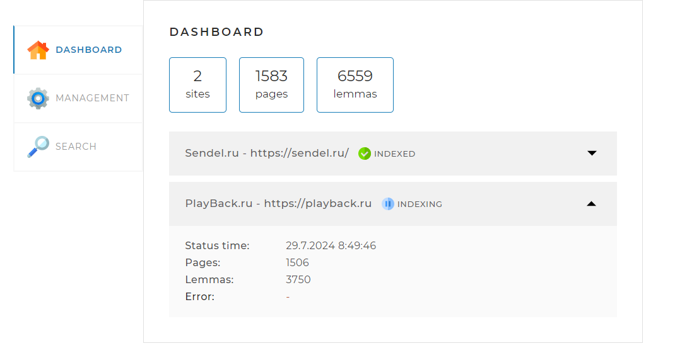
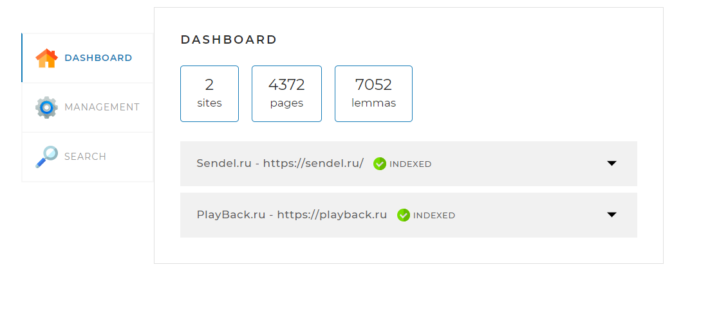
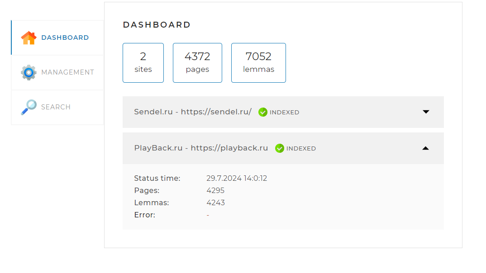
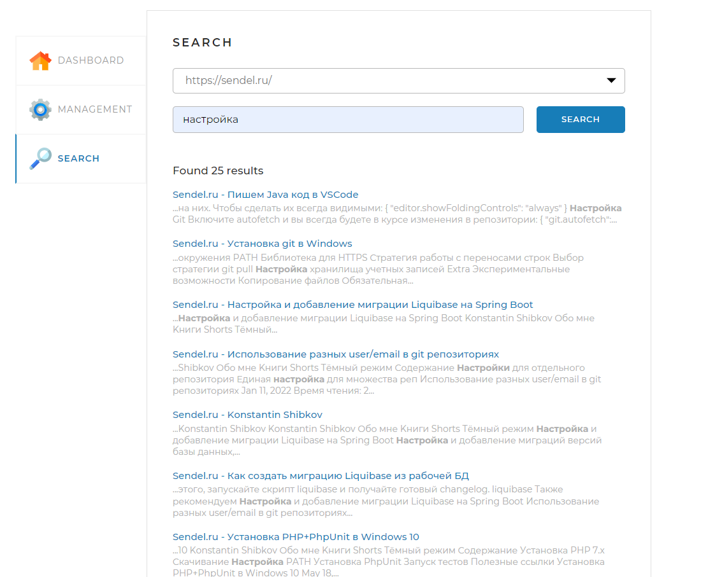
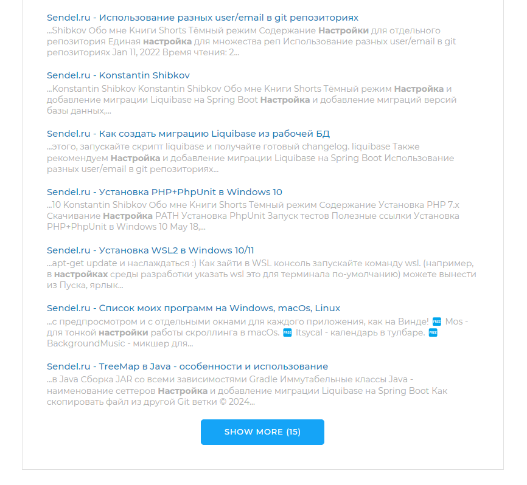
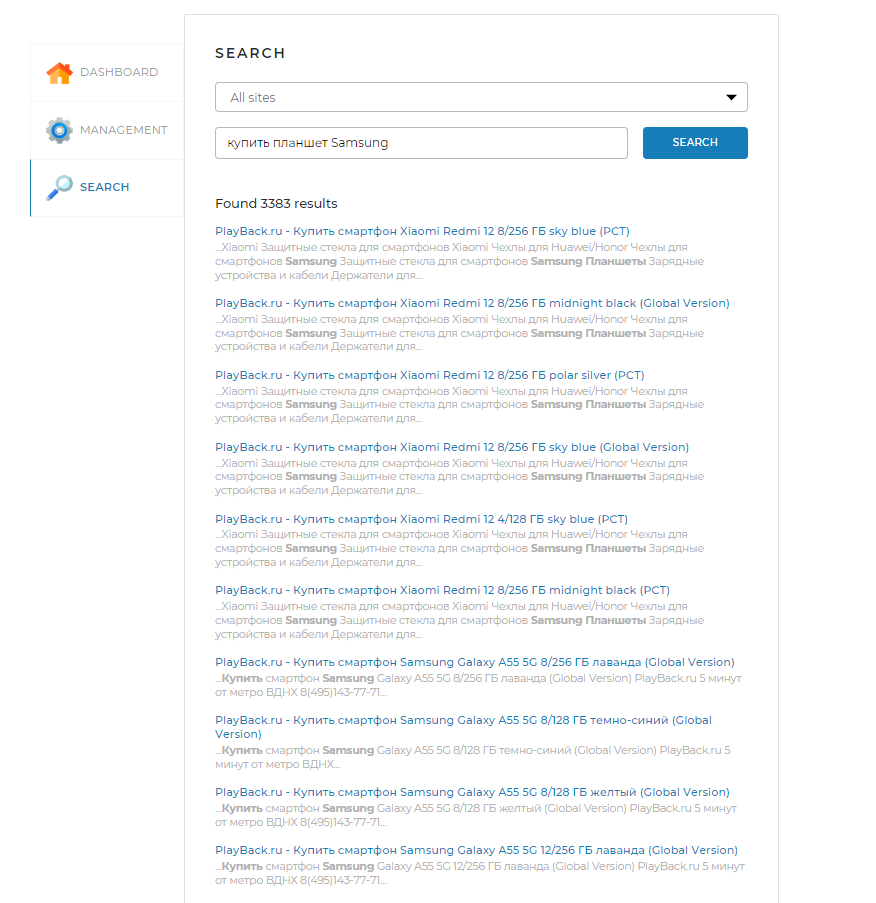
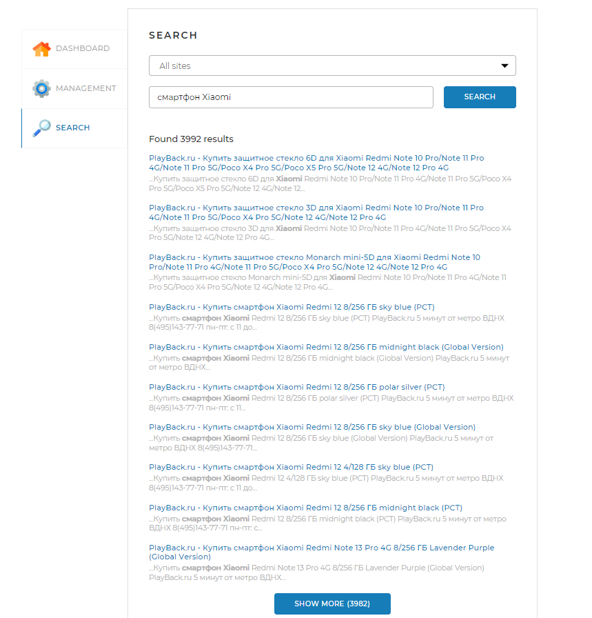

## Технологии

- **Spring Boot**
- **Maven**
- **MySQL**
- **Thymeleaf**
- **Lombok**
- **Jsoup**

## Особенности проекта

- **Многопоточность:** Обход страниц осуществляется в многопоточном режиме с использованием Fork-Join.
- **Лемматизация:** Используется для приведения слов к их базовой форме.
- **Мультиязычность:** Используется русскоязычный и англоязычный морфологический разбор.
- **Ранжирование результатов:** Реализована система ранжирования для выдачи наиболее релевантных страниц.
- **Вывод результатов:** Результаты поиска можно просматривать постранично.

## Установка и настройка

### Требования

- **JDK 11+**
- **Maven**
- **MySQL**

### Шаги для локального запуска

1. **Клонирование репозитория:**
    ```sh
    git clone https://github.com/pashtetrus33/SearchEngine.git
    cd SearchEngine
    ```

2. **Настройка базы данных:**
    - Установите MySQL.
    - Создайте базу данных:
      ```sql
      CREATE DATABASE search_engine;
      ```
    - Создайте пользователя и дайте ему права:
      ```sql
      CREATE USER 'username'@'localhost' IDENTIFIED BY 'password';
      GRANT ALL PRIVILEGES ON search_engine.* TO 'username'@'localhost';
      FLUSH PRIVILEGES;
      ```

    - **Или используйте Docker для запуска MySQL контейнера:**
      ```sh
      docker run --name search-engine-mysql -e MYSQL_ROOT_PASSWORD=root -e MYSQL_DATABASE=search_engine -e MYSQL_USER=username -e MYSQL_PASSWORD=password -p 3306:3306 -d mysql:8
      ```

3. **Настройка конфигурации:**
    - В корне проекта создайте файл `application.yaml`:
      ```yaml
      server:
        port: 8080
         
      spring:
        datasource:
          url: jdbc:mysql://127.0.0.1:3306/search_engine?useSSL=false&requireSSL=false&allowPublicKeyRetrieval=true
          username: user
          password: password
         
        jpa:
            hibernate:
              ddl-auto: update
            show-sql: true
            properties:
               hibernate:
                 dialect: org.hibernate.dialect.MySQL8Dialect
            open-in-view: true
         
        sql:
          init:
            data-locations: classpath:import.sql
            mode: always
         
      indexing-settings:
        sites:
          - url: https://sendel.ru/
            name: Sendel.ru
          - url: https://playback.ru
            name: PlayBack.ru
        referrer: https://www.google.com
        user-agent: HeliontSearchBot
        ```

4. **Сборка и запуск проекта:**
    ```sh
    mvn clean install
    mvn spring-boot:run
    ```

5. **Открытие в браузере:**
    - Перейдите в браузере по адресу [http://localhost:8080](http://localhost:8080).

## Структура проекта

- **src/main/java/searchengine**: Все классы проекта.
- **src/main/resources/templates**: HTML-шаблоны.
- **src/main/resources/static/assets**: Статические ресурсы (шрифты, изображения, скрипты).
- **src/main/resources/application.yaml**: Конфигурационный файл.


## Как помочь проекту

- **Сообщайте об ошибках:** Создавайте issues на GitHub.
- **Предлагайте улучшения:** Делайте pull requests.
- **Документируйте:** Помогите с улучшением документации.
